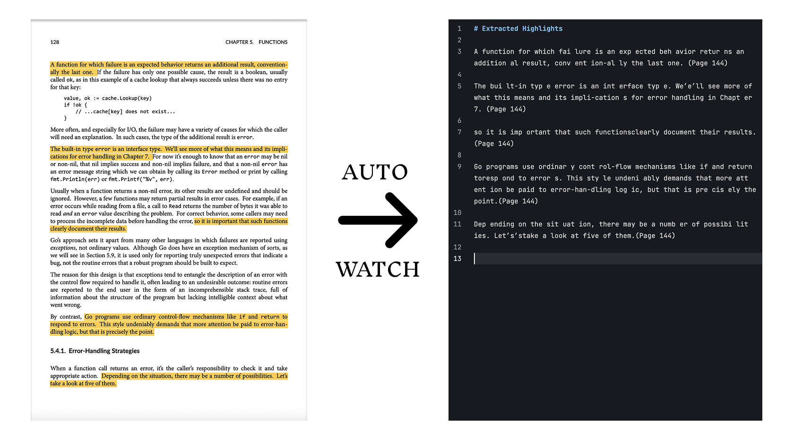

# readannots <sup><em>for PDF</em></sup>

[](https://pdm-project.org)

A simple Python tool for extracting and managing highlighting markdown from PDF files. Supports <strong>automatic monitoring</strong> of PDF file highlight annotations, and real-time export of highlighted content to Markdown files.



## Features

- Automatically monitor PDF file changes and update highlighting in real time.
- Export formatted Markdown files for easy reading and sharing.
- Support page offset configuration to adapt to different PDF file formats.

## Installation

This project uses PDM to manage dependencies. Make sure you have Python 3.13+ and PDM installed.

```bash
# Clone the project
git clone https://github.com/tianyw0/readannots.git
cd readannots

## install dependencies
pdm install
```

## How to use it

1. Place the PDF file to be read into the `src/unread` directory.

2. Use the `read` command to move the files to the monitor directory:

```bash
pdm run read . /unread/example.pdf
```

3. Start the monitoring service:

This project is carried out using VS Code, `.vscode > tasks.json` has been configured with the relevant tasks, when you open the project automatically start the monitoring service, automatically listen to the `src/reading` directory under the pdf file changes, highlight, save the pdf to try.

4. In the PDF reader to add the highlighted markup, the program will automatically export the content of the markup to the `src/reading` directory of the same name in the Markdown file.

## Configuration Instructions

The following parameters can be configured in `pyproject.toml`:

- `page-offset`: page offset, default is 2

## License

MIT
